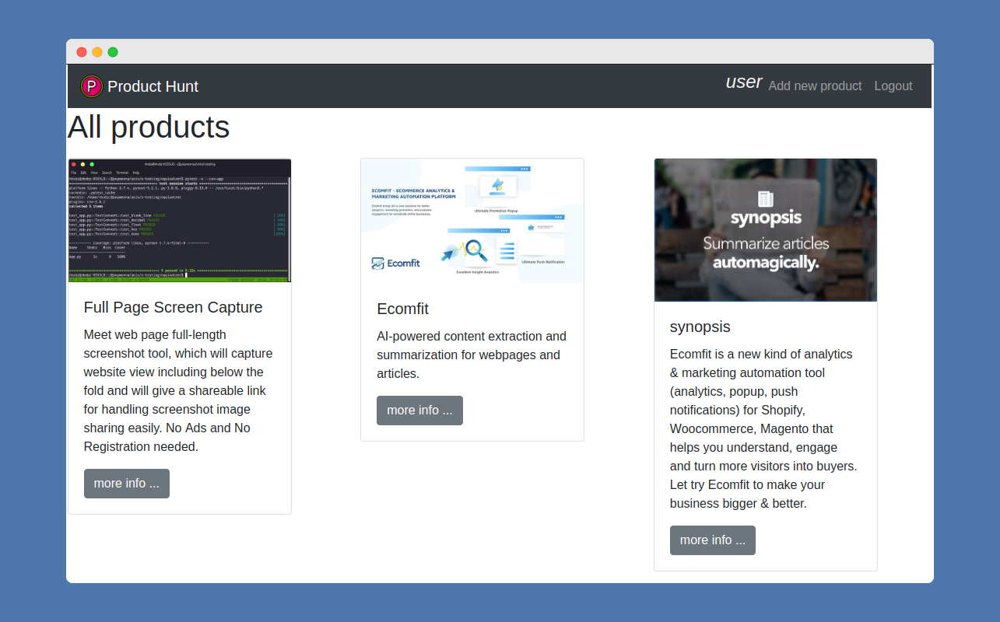
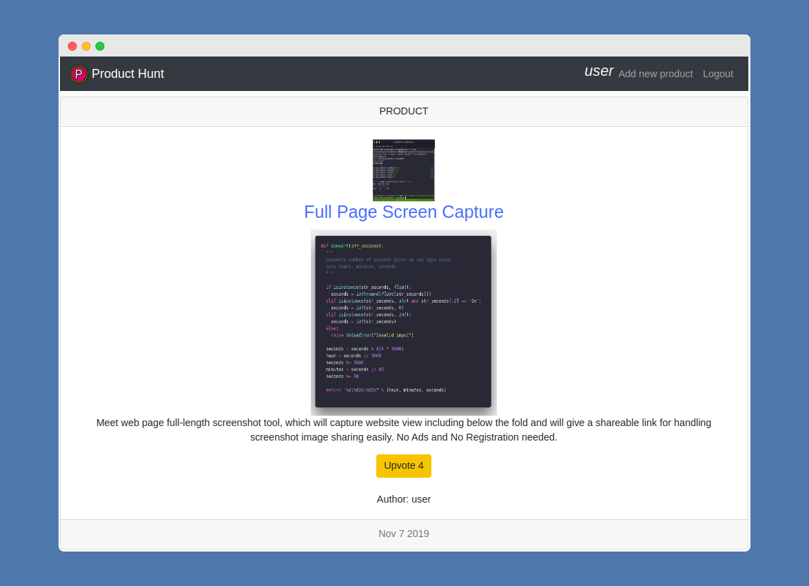
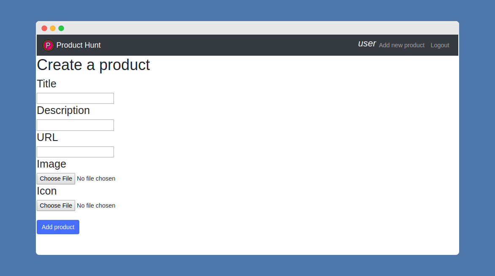
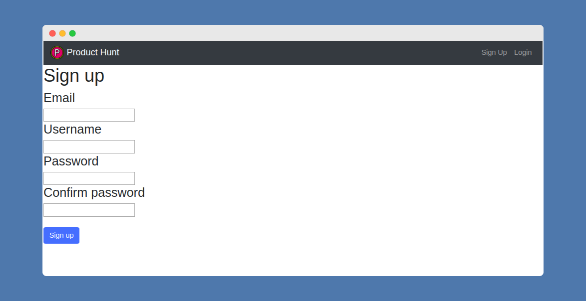

# Product Hunt Clone

### About

Web Application built on Python and Django that implements main features of [Product Hunt](https://www.producthunt.com/)

### Technologies

- Python 3.7.4
- Django 2.2.6

### Features

- Product adding.
- Product upvoting.
- Authentication and authorization [Sign up & Log in].
- Image uploading.

### Installation

Install via pip: `pip install -Ur requirements.txt`

If you do NOT have `pip`, please use the following methods to install:
- OS X / Linux, run the following commands: 

    ```
    curl http://peak.telecommunity.com/dist/ez_setup.py | python
    curl https://raw.github.com/pypa/pip/master/contrib/get-pip.py | python
    ```

- Windows：

    Download http://peak.telecommunity.com/dist/ez_setup.py and https://raw.github.com/pypa/pip/master/contrib/get-pip.py, and run with python. 

## Database

This project uses Postgresql as a main database. If you want to use another, feel free to do it. To do that you have to modify `blog/settings.py`:
```python
DATABASES = {
    'default': {
        'ENGINE': 'django.db.backends.postgresql_psycopg2',
        'NAME': 'producthuntdb',
        'USER': 'dbuser',
        'PASSWORD': 'django123',
        'HOST': 'localhost',
        'PORT': '',
    }
}
```

To continue with Postgresql database run the following commands in `psql` shell:
```sql
CREATE DATABASE producthuntdb;
CREATE USER dbuser WITH PASSWORD 'django123';
ALTER ROLE dbuser SET client_encoding TO 'utf8';
ALTER ROLE dbuser SET default_transaction_isolation TO 'read committed';
ALTER ROLE dbuser SET timezone TO 'UTC';
GRANT ALL PRIVILEGES ON DATABASE producthuntdb TO dbuser;
```

Run the following commands in Terminal:
```bash
./manage.py makemigrations
./manage.py migrate
```

**Attention: ** Before you using `./manage.py`, make sure the `python` command in your system is towards to `python 3.6` or above version. Otherwise you may solve this by one of the two following methods:
- Modify the first line in `manage.py`, change `#!/usr/bin/env python` to `#!/usr/bin/env python3`
- Just run with: `python3 ./manage.py makemigrations`

### Create super user

Run command in terminal:
```bash
./manage.py createsuperuser
```

### Getting start to run server
Execute: `./manage.py runserver`

Open up a browser and visit: http://127.0.0.1:8000/ , the you will see the blog.

### Screenshots

#### Home - Product list



#### Product



#### Add product



#### Sign Up



License
----

MIT

